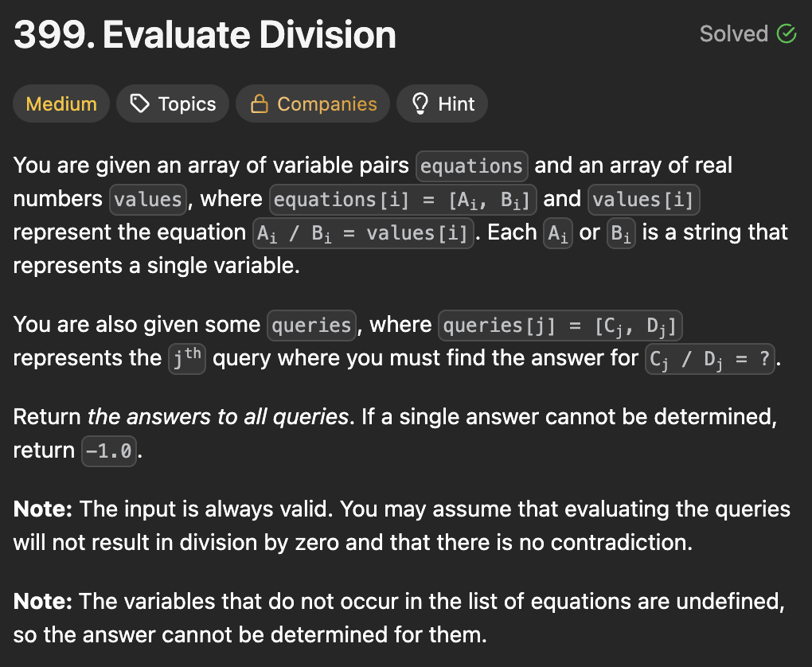
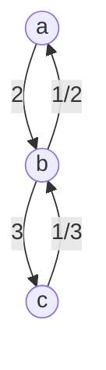

I recently solved the LeetCode problem *Evaluate Division* and this problem stood out because it looks downright impossible at first, until you figure out the trick.



Take some time to read the problem description, because I'll now get into the details of how you solve it.

## Breaking down the problem

Suppose we're dealing with a small example:

- The two equations are $a/b = 2$ and $b/c = 3$.
- The queries are $a/c = ?$, $b/a = ?$, and $a/e = ?$.

Your first intuition, and mine as well, is to first find the values of $a, b, c$ and use these values to solve the queries. However, the genius of this problem is that you soon realize that this is mathematically impossible. Why? Because with 3 unknowns and 2 equations, you cannot determine the exact values of each variable. You'd need at least 3 equations.

So how do we solve a query like $a/c$?

The key is observing that $a/c = (a/b) \times (b/c)$. We know the values of $a/b$ and $b/c$ (2 and 3) so we just multiply them together to get 6. In other words, we can solve a query by representing them as a product of other queries that we know the values of.

In fact, this works with any equation involving $a$, $b$, and $c$. How do we solve $b/a$? Easy - $b/a$ is just the reciprocal of $a/b$, so it's $1/2$. How about $a/e$? The problem wants us to return $-1$ when the query is invalid, and since $e$ doesn't exist as part of the original set of equations, we can return $-1$ right off the bat.

But how about something more complex like $c/a$? We see that $c/a$ can actually be broken down into $(c/b) \times (b/a)$, and since we know $b/c$ and $a/b$, we just find the reciprocal of those pairs to get $c/a = (1/3) \times (1/2) = 1/6$.

## Modeling the problem as a graph

We can make calculations like these across a large number of variables and equations by representing the problem as a weighted graph, where the variables are nodes and the quotients are the edges.

For example, the equation above looks like this:



In general, every equation becomes two nodes connected by two edges, one forward and one reciprocal. For example, for $b/c = 3$, we create a node $b$ and a node $c$ and an edge with weight 3 pointing from $b$ to $c$. Because $c/b$ is just the reciprocal, we also create a corresponding edge in the opposite direction.

With this graph representation, finding the answer to a query is just a matter of traversing the graph and multiplying the edge weights along the way. For example, to find $c/a$ we multiply $1/3$ and $1/2$, to, indeed, get $1/6$.

For the traversal itself, BFS works well here because we just want to do a straightforward traversal. BFS helps prevent us from taking unnecessarily long paths since it always finds the shortest path.

The graph itself can be represented as an adjacency list using a Python `dict`.

## Python implementation

Here's my Python solution:

```python
class Solution:
    def calcEquation(self, equations: List[List[str]], values: List[float], queries: List[List[str]]) -> List[float]:
        adj_list = defaultdict(list)

        for i, eq in enumerate(equations):
            numerator = eq[0]
            denominator = eq[1]
            adj_list[numerator].append((denominator, values[i]))
            adj_list[denominator].append((numerator, 1/values[i]))

        def bfs(src, target) -> float:
            visited = set([src])
            queue = deque([(src, 1)])
            if src not in adj_list or target not in adj_list:
                return -1
            
            while queue:
                curr_node, product = queue.popleft()
                if curr_node == target:
                    return product
                
                for neighbor, weight in adj_list[curr_node]:
                    if neighbor not in visited:
                        visited.add(neighbor)
                        queue.append((neighbor, product * weight))
            
            return -1


        return [bfs(num, denom) for num, denom in queries]
```

## Complexity analysis

If $V$ is the number of nodes in the graph and $E$ is the number of edges, then the complexities are:

- Building the weighted graph requires $O(V + E)$ time to insert all edges into the adjacency list.
- Each query takes $O(V + E)$ time to explore the graph with breadth-first search.
- The overall time complexity is $O(Q \times (V + E))$ across $Q$ total queries.
- The space complexity is $O(V + E)$ to store the graph adjacency list and the queue.

Note: this isn't the most optimal solution possible (the optimal solution involving weighted union-find), but it is the most intuitive, reasonably efficient, and it gets the job done.
